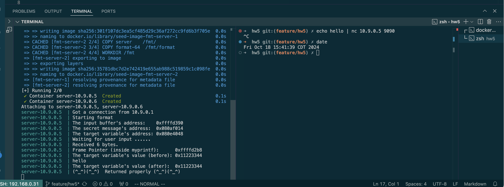
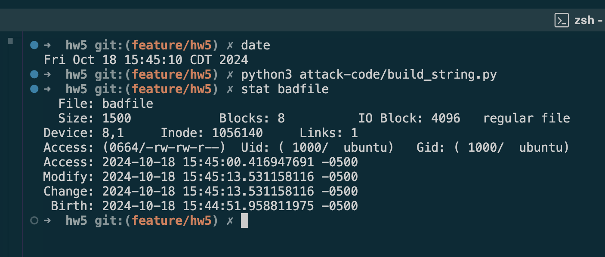
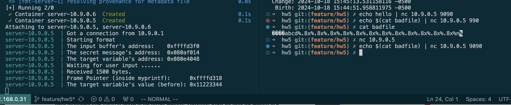
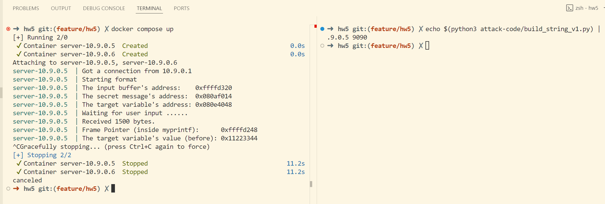
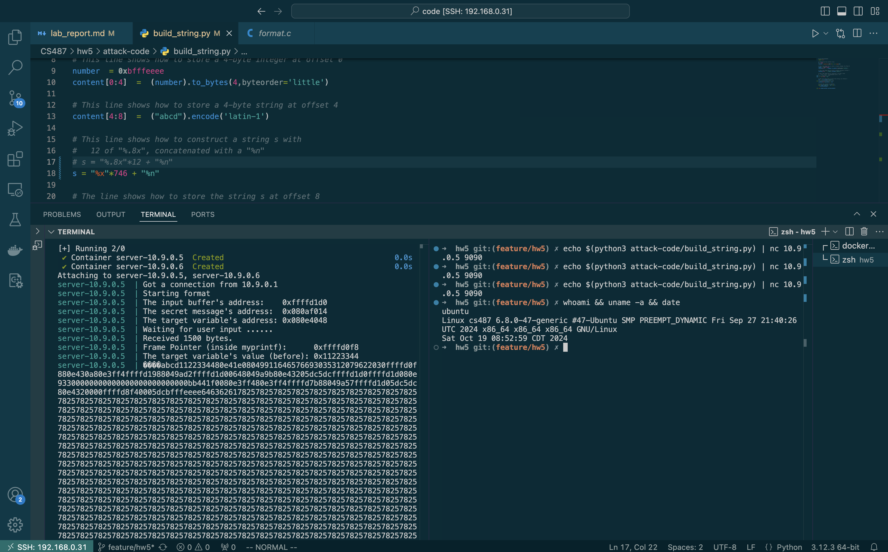
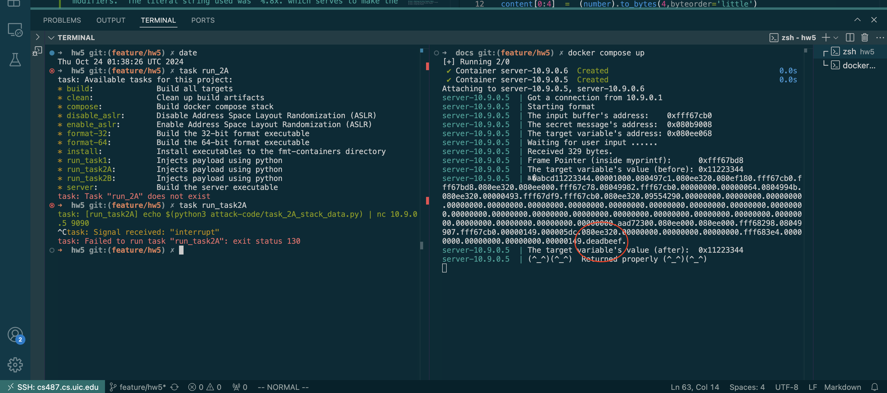
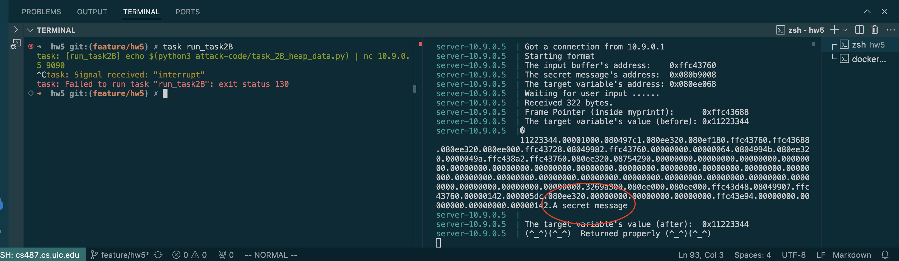
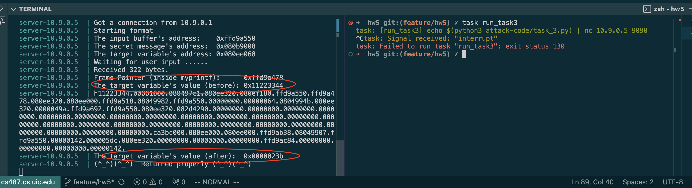
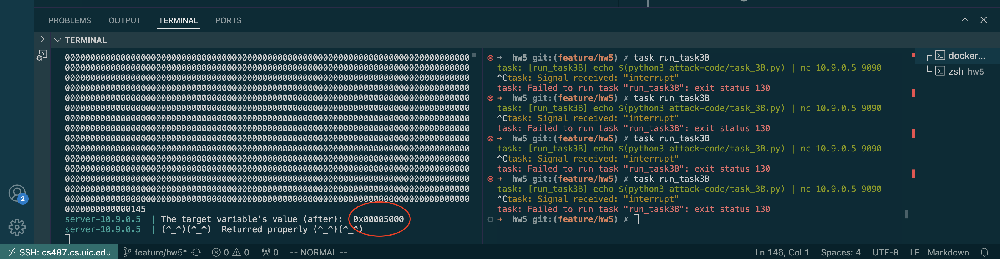

# Lab Report: Format String Attack Lab

Robert D. Hernandez <rherna70@uic.edu>

## Env Setup

Disable Address Space Layout Randomization

`sudo sysctl -w kernel.randomize_va_space=0`

## Task 1: Crashing the Program

Initial run with benign input


Create initial payload file:


Injecting inital payload to format program


After changing the line `build_string.py` program line 

```c
s = "%.8x"*1200 + "%n"
```
to 
```c
s = "%s"*12
```

`format` Program crashes as expected:



My solution for Task 1 is located at `./attack-code/task_1_crash_program.py`

Start the docker compose stack, and invoke it with

```sh
$ task run_task1
```
then Press Ctrl+C.

We use a format string with twelve (12) %s format string modifiers to encounter the first memory address that is invalid.


## Task 2: Printing out the Server Program's Memory
### Task 2.A: Stack Data

My solution for Task 2A is located at `./attack-code/task_2A_stack_data.py`


Start the docker compose stack, and invoke it with

`
$ task run_task2A
`

then Press Ctrl+C.

We use the python program to create an input buffer with a number at it's highest memory value and a sequence four dummy chars "abcd" (not important to the solution), followed by sixty-four (64) modified "%x" modifiers.  The literal string used was "%.8x." which serves to make the program output slightly more human readable by placing full stops between memory elements.

The 64th index was found through trial and error by first printing quite a bit of the stack and experimenting with smaller values.



Importantly, we observe that the program prints the bytes as a string instead of as a number.



This observation is significant because it here at the 64th index that we observe the alignment of the va_list pointer in printf with the data that we injected at runtime through user input "3735928559" as a hexademical number "0xdeadbeef".


### Task 2.B: Heap Data

My solution for Task 2A is located at `./attack-code/task_2A_stack_data.py`


Start the docker compose stack, and invoke it with

```sh
$ task run_task2B
```

then Press Ctrl+C.

With the va_list pointer aligned at the 64th element, we replace "%x" with "%s" and we replace the bytes for our number with the address on the heap of the char buffer of the string we want to print using the "%s" format modifier.

```c
s = "%.8x."* 63 + "%s"
```

When executing our attack with netcat, we cause the format program to print the buffer at the memory address we injected over the network via user input.



## Task 3: Modifying the Server Program's Memory
### Task 3A: Change the value to a different value

My solution for Task 3A is located at `./attack-code/task_3A.py`
Invoke it similarly to the solution for Task 2

With the va_list pointer aligned at the 64th element, we replace "%x" with "%n" and we cause the program to write at the address of va_list the number of bytes printed up until the %n format specifier was encountered.


```c
s = "%.8x."* 63 + "%n"
```
We then observe that the value of the target variable was written by our format string attack:



### Task 3B: Change the value to 0x5000

My solution for Task 3B is located at `./attack-code/task_3B.py`
Invoke it similarly to the solution for Task 2

First we convert 0x5000 to decimal, which is equivalent to 20480.

We know we will print 4 characters fot the address at the begining of our attack input.

We will want to modify our last "%x" modifier from Task 3A with a precision calculation.

```c
s = "%.8x."* 63 + "%n"
```

As we will use 62 "%x" format specifiers before the precision modifier, we will have printed (62*8)+4=500 characters before our modifier.

20480 - 500 = 19,980

So we will want to start by using

```c
s = "%.8x."*62 +"%.19980x" +"%n"
```

through trial and error we found that this changed the variable to hex "0x0000503e" which is decimal "20542" or 62 off from our target, so using
```c
s = "%.8x."*62 +"%.19918x" +"%n"
```

We see the value of our target integer changes to our target value:



## Task 4: Inject Malicious Code into the Server Program
## Task 5: Attacking the 64-bit Server Program
## Task 6: Fixing the Problem
