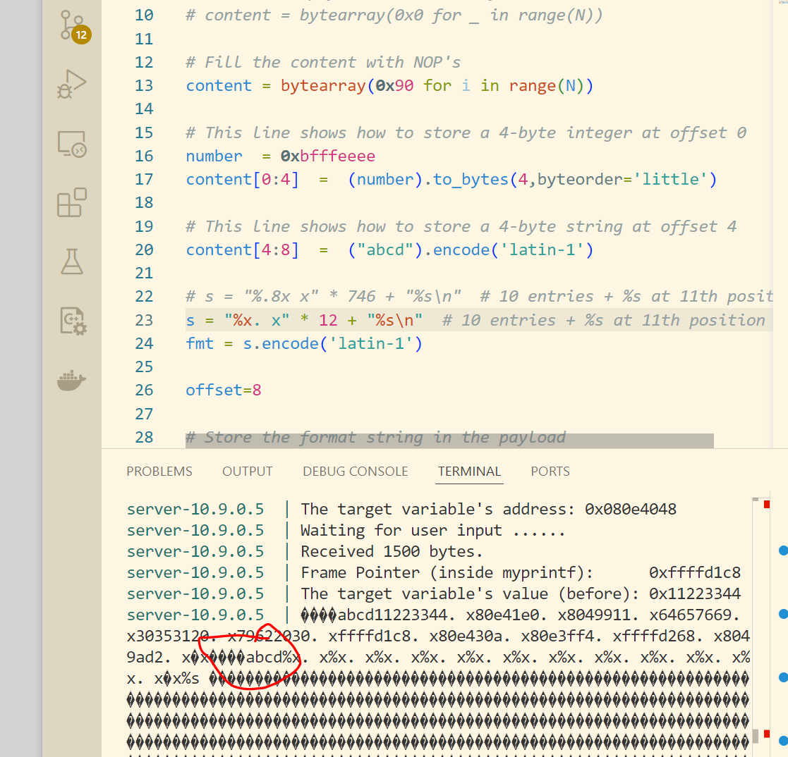

# Lab Report: Format String Attack Lab

Robert D. Hernandez rherna70@uic.edu

## Env Setup

Disable Address Space Layout Randomization

`sudo sysctl -w kernel.randomize_va_space=0`

## Task 1: Crashing the Program

Initial run with benign input

Create initial payload file:

Injecting inital payload to format program

After changing the line `build_string.py` program line 

`# s = "%.8x"*1200 + "%n"`
to 
`s = "%s"*12`

`format` Program crashes as expected:

## Task 2: Printing out the Server Program's Memory

### Task 2.A: Stack Data

I used a binary search style to quickly find that the program needs at least 746 "%x" format specifiers to produce execution behavior that causes it to print my payload and some stack data.  I found this by taking line 17 of the build_string.py program and both editing the chars produced and by increasing the count from 12 by powers of 10 until I found it caused the desired behavior at 1200 format specifiers.  I then halved the count of format specifiers and would increase them by half the distance to the last and so on: 12=>120=>1200=>600=>900=>750=>675 etc etc until i found 746 as the minimum number of format specifiers

After some 

### Task 2.B: Heap Data

After some effort I was able to start finding and printing strings from the stack, the image belows finding the offset for the "abcd" string using 12 format specifiers and printing it using `%s`.  My next step is to the find the secret message on the stack.

## Task 3: Modifying the Server Program's Memory
## Task 4: Inject Malicious Code into the Server Program
## Task 5: Attacking the 64-bit Server Program
## Task 6: Fixing the Problem
