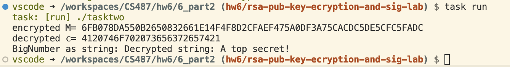
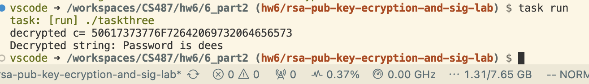

# Lab Report: Secret Key Encryption Lab <!-- omit in toc -->

Robert D. Hernandez <rherna70@uic.edu>

## Task 1: Deriving the Private Key

My solution is in `taskone.c`

Let p,q and e be three prime numbers.  Let n = p*q.  We will use (e, n) as the public key.

Given:

p = F7E75FDC469067FFDC4E847C51F452DF
q = E85CED54AF57E53E092113E62F436F4F
e = 0D88C3

Calculate the private key d.


First n was calculated to be "n=E103ABD94892E3E74AFD724BF28E78366D9676BCCC70118BD0AA1968DBB143D1"

phi(n) = (p - 1) * (q - 1)
phi(n) = D2E88FE4EEB33F597D5F1B0D2D96EDD5156C94EC27065CFB268768CA1738BBC4
d = A90C278677B53385F22D2792D6E3A0FC1D1E537FAF4325779577A6BCA11BE65B


Note: Using Wolfram Alpha, the Decimal value of p was found to be 329520679814142392965336341297134588639
Note: Using Wolfram Alpha, the Decimal value of q was found to be 308863399973593539130925275387286220623
Note: The decimal value of e was small enouch to fit in a programmer's calculator and was found to be 886979
Note: n, phi(n), and d were computed using the <openssl/bn.h>

## Task 2: Encrypting a Message

My solution is in `tasktwo.c`

I found the encryped version of the message was "6FB078DA550B2650832661E14F4F8D2CFAEF475A0DF3A75CACDC5DE5CFC5FADC" in hex.  I checked that the encryption was correct by decrypting the message.

```sh
vscode ➜ /workspaces/CS487/hw6/6_part2 (hw6/rsa-pub-key-ecryption-and-sig-lab) $ task run
task: [run] ./tasktwo
encrypted M= 6FB078DA550B2650832661E14F4F8D2CFAEF475A0DF3A75CACDC5DE5CFC5FADC
decrypted c= 4120746F702073656372657421
BigNumber as string: Decrypted string: A top secret!
```



## Task 3: Decrypting a Message

Decrypt: C = 8C0F971DF2F3672B28811407E2DABBE1DA0FEBBBDFC7DCB67396567EA1E2493F

My solution is in `taskthree.c` I found the ciphertext to decrypt to "Password is dees"

```
vscode ➜ /workspaces/CS487/hw6/6_part2 (hw6/rsa-pub-key-ecryption-and-sig-lab) $ task run
task: [run] ./taskthree
decrypted c= 50617373776F72642069732064656573
Decrypted string: Password is dees
```



## Task 4:
## Task 5:
### 5.1:
## Task 6:
## Task 7:
