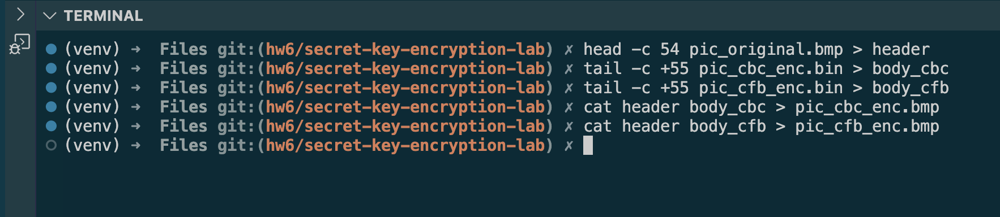
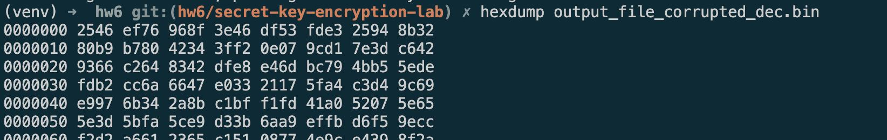

# Lab Report: Secret Key Encryption Lab

Robert D. Hernandez <rherna70@uic.edu>

## Env Setup

Disable Address Space Layout Randomization

`sudo sysctl -w kernel.randomize_va_space=0`

## Task 1: Frequency Analysis

Given some trial and error first substituted the longest n-grams with the highest ngrams "the" and "and", then moved onto a few longer 2-n grams testing "in" and "er" and from there I was able to make out some smaller words and was able to character-by-character read and translate the doc.  The resulting key was "ytnvupmuqxifahlbrcdzgsokejw" and the plantext is viewable with:

```sh
tr 'ytnvupmuqxifahlbrcdzgsokejw' 'THEANDINSOLVCRWFGMYUBKJXPQZ' < ciphertext.txt > out.txt
```

## Task 2:

Below you can see the encryption commands I used, I tried all three cipher modes described, it seems like my vm did not support `-bf-cbc`

```sh
openssl enc -aes-128-cbc -e -in plain.txt -out cipher.bin \
    -K 00112233445566778889aabbccddeeff \
    -iv 0102030405060708

openssl enc -bf-cbc -e -in plain.txt -out cipher.bin \
    -K 00112233445566778889aabbccddeeff \
    -iv 0102030405060708

openssl enc -aes-128-cfb -e -in plain.txt -out cipher.bin \
    -K 00112233445566778889aabbccddeeff \
    -iv 0102030405060708
```


## Task 3:

I was able to encrypt the picture using CBC mode, which was straightforward, although my machine did not support ECB mode so I will also encrypt and compare with CFB mode


Commands used for re-writing the header hex values so we can render the image:



And the image encrypted with CBC mode here:


And the image encrypted with CFB mode here:


We do not see any useful information from the encrypted picture

## Task 4:

Requiring padding for an given cipher algorithm is really a function of whether we use block cipher or not.  If we use a block cipher, the plaintext must be the same size as the block cipher encryption which we can right-size using padding.  Converting a block cipher to a stream cipher elimintates this need.

### 4.2
First we create the files:


Then we create encrypted versions using `-aes-128-cbc`


We notice that the first two files that were less than 16 bytes were padded to 16 bytes and we see that curious enough the one that was 16 bytes was padded to 32 bytes.

Finally we decrypt and view the padded bytes using a hexdump tool:


## Task 5:

### 5.1: Create a text file that is at least 1000 bytes long.

```sh
dd if=/dev/urandom of=output_file.bin bs=1 count=1000
```

### 5.2 Encrypt the file using the AES-128 cipher

```sh
openssl enc -aes-128-cbc -e -in output_file.bin -out output_file_cipher.bin \
    -K 00112233445566778889aabbccddeeff \
    -iv 0102030405060708
```
### 5.3 Oh no! One byte got corrupted

```sh
xxd -r -s 54 -l 4 -p <(echo deadbeef) output_file_cipher.bin
```
### 5.4 Decrypt and hexdump corrupted version and compare with original

We can clearly demonstrate that changing one byte of an encrypted file stops it from being decrypted correctly entirely

Corrupted version


Original version


Comparing using vimdiff for good measure

```sh
vimdiff <(hexdump output_file_corrupted_dec.bin) <(hexdump output_file.bin)
```


This doesn't entire hold with the theory of ECB, CBC, CFB, and OFB which where we should expect only a small amount of data to be undecryptable, where the theory would purport that we would only loose a single 16 byte block for ECB and CFB mode, 2 16-byte blocks for CBC, and only the single corrupted byte for OFB.  Perhaps I made a  mistake decrypting.

## Task 6:
## Task 7:
