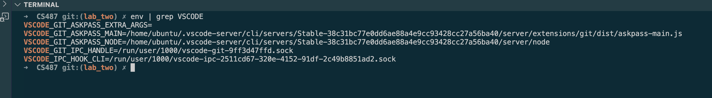
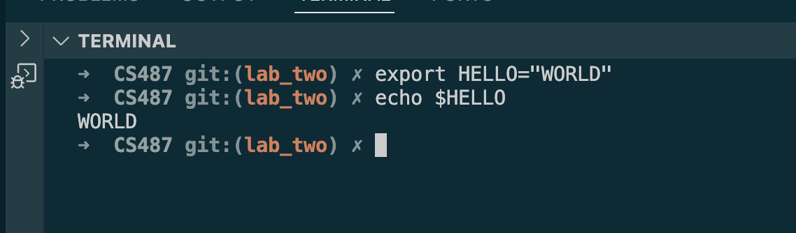
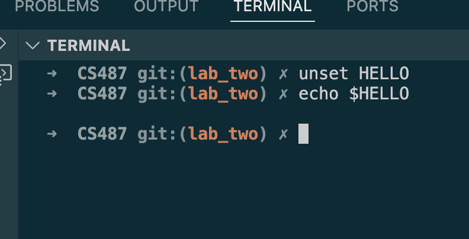
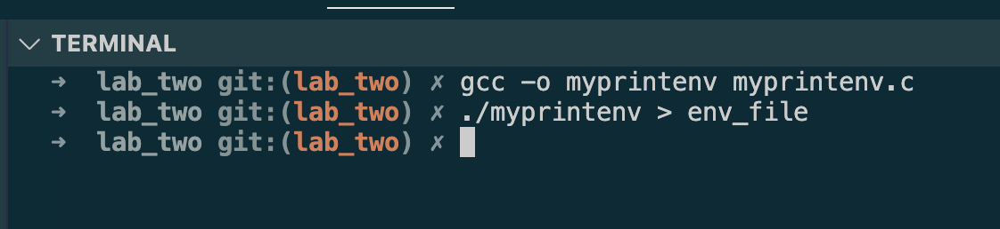
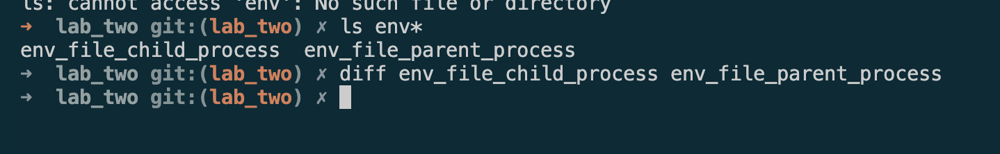
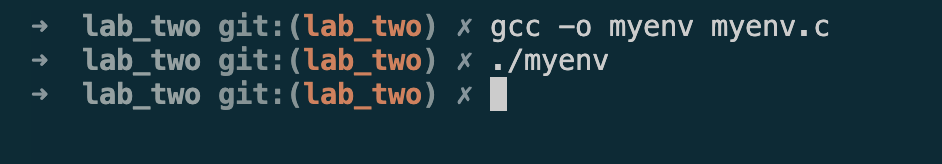
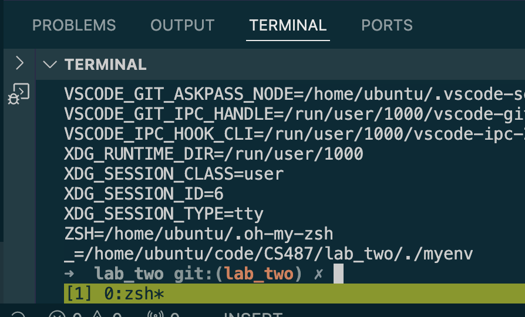
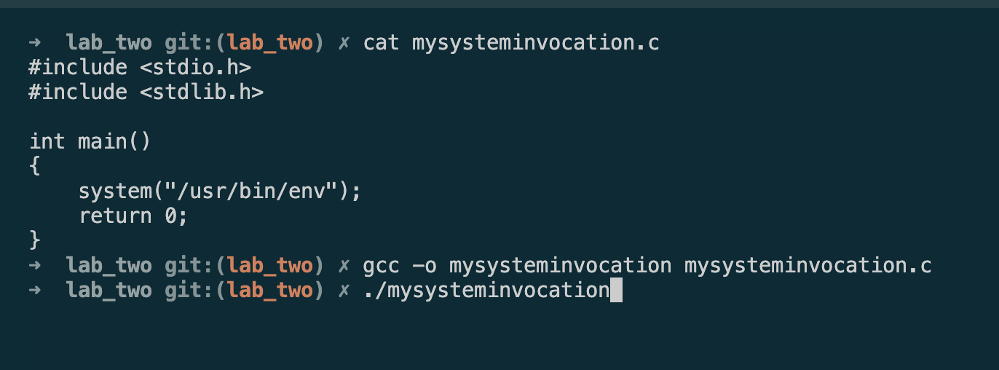
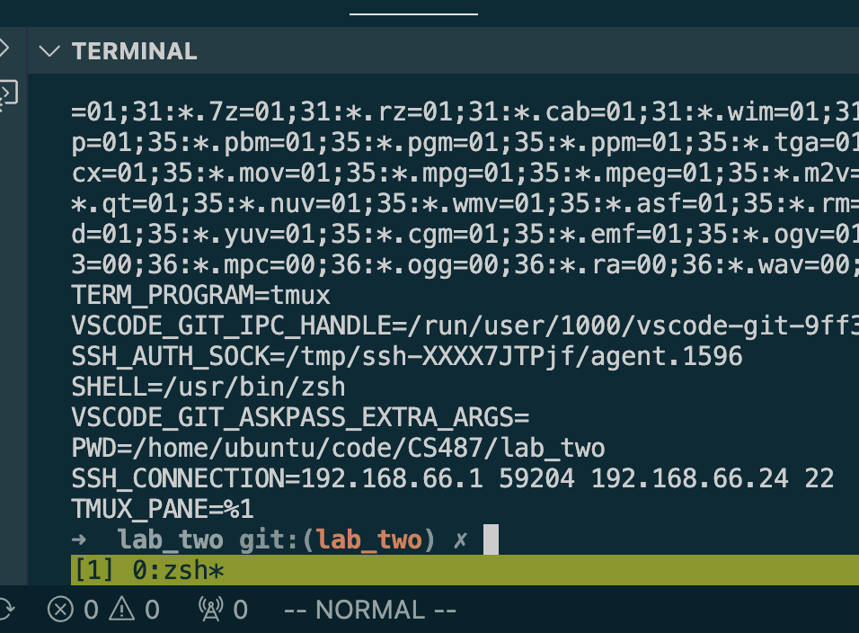
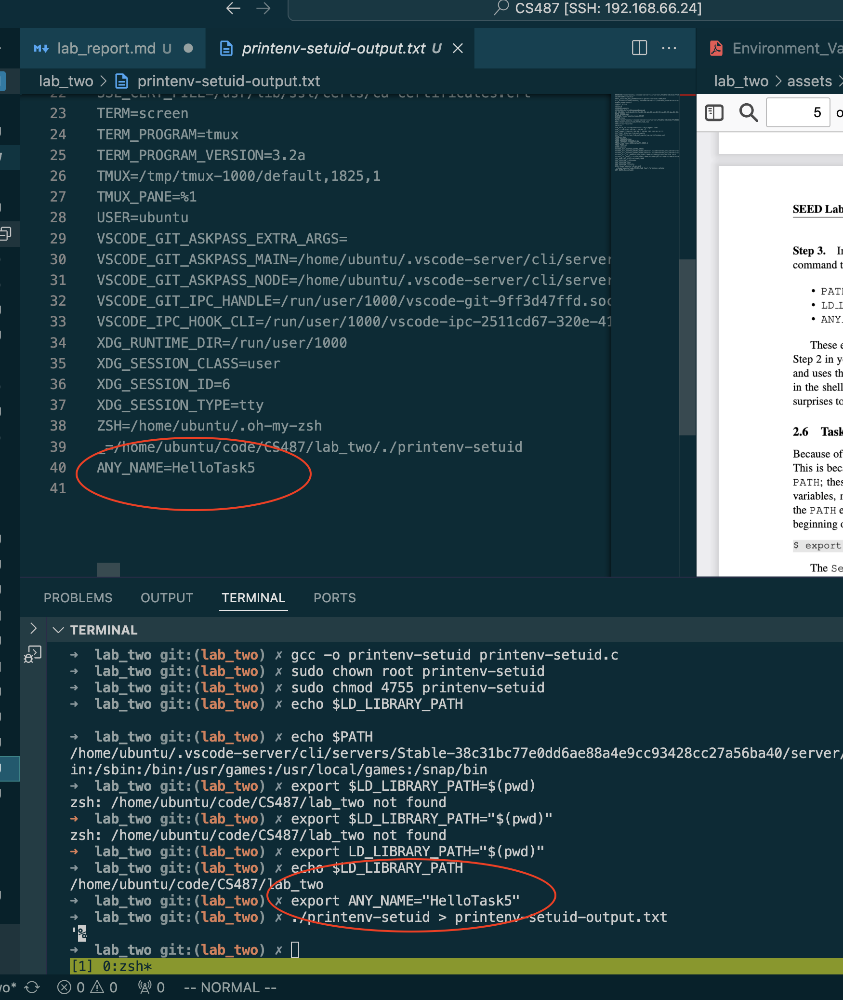

## Environment Variable and Set-UID Program Lab

Robert D. Hernandez rherna70@uic.edu

REF: https://seedsecuritylabs.org/Labs_20.04/Files/Environment_Variable_and_SetUID/Environment_Variable_and_SetUID.pdf

This lab covers the following topics:

- Environment variables
- Set-UID programs
- Securely invoke external programs
- Capability leaking
- Dynamic loader/linker

### 2.1 Task 1: Manipulating Environment Variables

```sh
$ env | grep VSCODE

> VSCODE_GIT_ASKPASS_EXTRA_ARGS=
> VSCODE_GIT_ASKPASS_MAIN=/home/ubuntu/.vscode-server/cli/servers/Stable-38c31bc77e0dd6ae88a4e9cc93428cc27a56ba40/server/extensions/git/dist/askpass-main.js
> VSCODE_GIT_ASKPASS_NODE=/home/ubuntu/.vscode-server/cli/servers/Stable-38c31bc77e0dd6ae88a4e9cc93428cc27a56ba40/server/node
> VSCODE_GIT_IPC_HANDLE=/run/user/1000/vscode-git-9ff3d47ffd.sock
> VSCODE_IPC_HOOK_CLI=/run/user/1000/vscode-ipc-2511cd67-320e-4152-91df-2c49b8851ad2.sock
```



```sh
$ export HELLO="WORLD"
$ echo $HELLO
> WORLD
```


```sh
$ unset HELLO
$ echo $HELLO
>
```


2.2 Task 2: Passing Environment Variables from Parent Process to Child Process

"*In this task, we would like to know whether the parent’s environment variables are inherited by the child process or not.*"

```sh
$ gcc -o myprintenv myprintenv.c
$ ./myprintenv > env_file
```



After recompiling such that the parent process runs the function, we find no change in envrionment variables.  This provides evidence that environment variables are propogated from parent to child when calling `fork()`




### 2.3 Task 3: Environment Variables and execve()

In this task, we study how environment variables are affected when a new program is executed via execve().
The function execve() calls a system call to load a new command and execute it; this function never re-
turns. No new process is created; instead, the calling process’s text, data, bss, and stack are overwritten by
that of the program loaded. Essentially, execve() runs the new program inside the calling process. We
are interested in what happens to the environment variables; are they automatically inherited by the new
program?

Compiling and running `myenv.c` yields no output


After passing in `environ` as the first parameter to `execve()` the values are printed.  This shows that the environment variables in an `execve()` invocation are dependend on the third parameter, that the env is not automatically passed to the new program.




2.4 Task 4: Environment Variables and system()

In this task, we study how environment variables are affected when a new program is executed via the
`system()` function.




### 2.5 Task 5: Environment Variable and Set-UID Programs



When running the setuid program, we see that yes in fact the environment variables set in the shell (parent) process get set in the child process.

### 2.6 Task 6: The PATH Environment Variable and Set-UID Programs
